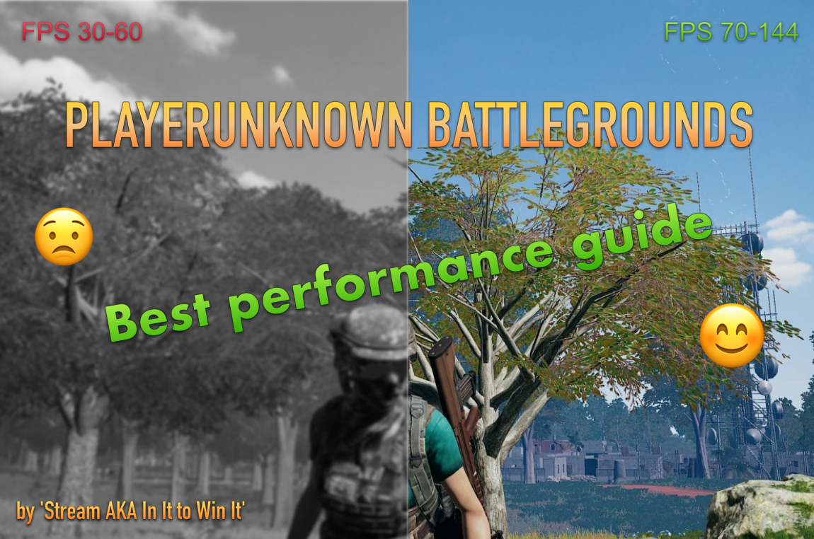

Hello,
It's your boy - ‘**Stream**’ AKA ‘**In It To Win It**’, here.

It's been almost 2.5 years since I started playing PUBG.
We all know that - PlayerUnknown Battlegrounds has always had really different states and with every single update, the game seems to work totally different.

As a competitive PUBG player, I have been asked many times about how to increase your FPS in PUBG.
Since end of Alpha and beginning of Beta, I have dealt with almost every possible type of FPS stuttering, freeze and other issues.
Many problems you can fix yourself, but you need to remember one thing - Only devs can fully optimize the game and fix all of the problems.
You can get a lot smoother experience by following all of the steps from my guide which is a huge gathering of the most popular and the least popular 'fixes' that can improve your smoothness and increase your FPS in PUBG.

Funny thing... Even 'placebo' changes that Have 0.01% impact on your performance, MIGHT improve your ingame performance.
Funny, right? PUBG is weird :)

I have read a lot of forums (Nvidia/Windows/PUBG) and I am gonna be honest with you - It's 2019 and PUBG still have a lot of problems.
My friends with 'NASA PCs' are not free from problems, but this guide helped them a lot so...

Dear Pubg players - I have a special gift for you :)
Hope my guide is gonna help you and you'll not be as frustrated as you are when you die because of game performance or suddenly ping raises and freezes.

The guide is a result of an organized group mostly amateurs (Idea maker; Content/fix provider; group of testers; designer). We have not been paid to make this guide.
We made it to help PUBG community at dealing with performance problems the game suffers.
We really love PUBG, we wish it good luck and we wanna have the same chances during fight with every player! Me and my group remember periods of the game in which Better PC = More chance to kill somebody. Sadly, the game still has problems and somebody had to provide a little help to PUBG Devs and huge PUBG Community.

If you wanna show me your appreciation - Please, like my guide, add it to fav, show it to your friends (maybe they also have problems with PUBG), or maybe you wanna sent me something.
Every kind of appreciation will be appreciated :D

- https://www.buymeacoffee.com/Stream
- https://steamcommunity.com/tradeoffer/new/?partner=177717593&token=NO-4pP9D

I have tested many things from my guide since Vikendi update.
What I noticed? Every single update, game worked totally different and some FPS fixes worked, but the next update you had to revert them into previous previous ones. Weird, right? I don't really know, but it really worked.

Let's start then.

## TABLE OF CONTENTS

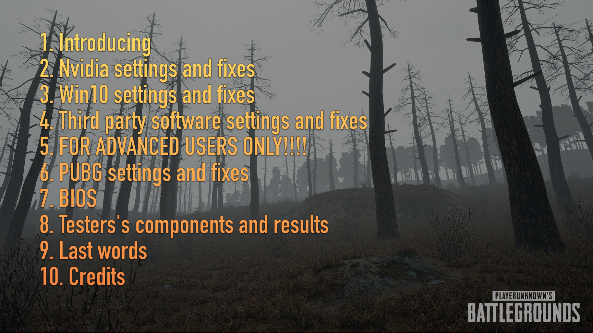

## Nvidia fixes and settings
### 1. Nvidia Drivers

Before installing new drivers, use DDU software in Win10 Safe Mode to totally delete your current drivers from your system.
Restart Windows and install new ones.

GTX users - The best performance in PUBG you can get by using those drivers: 391.01 > first version of 417 > 388.71
I can not really tell you which one will perform the best on your GTX, so you gotta try all of them yourself.

RTX users - 430. 64 > 425 > 419 > 417
As an RTX user, I can confirm the best possible performance I get on 430.64 and 425 drivers.
The difference is about 0.5-1.7 fps.

### 2. Nvidia Control Panel
Just copy my settings :)

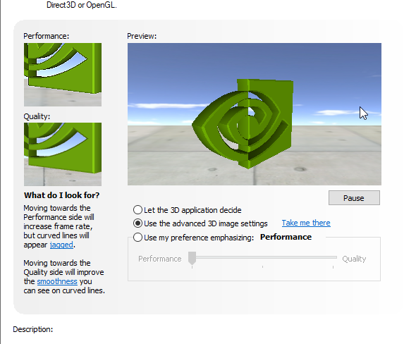
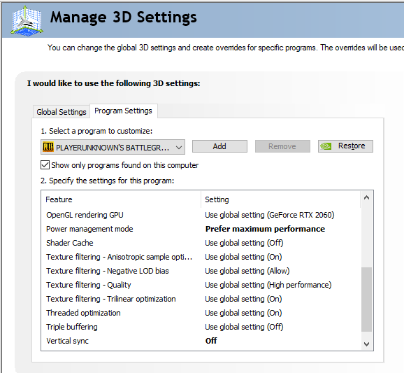
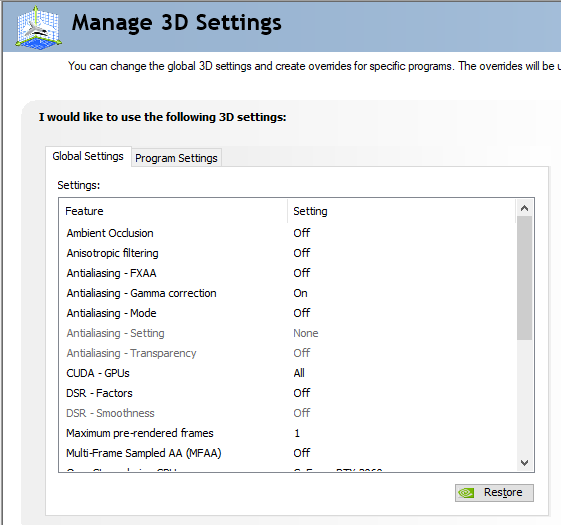
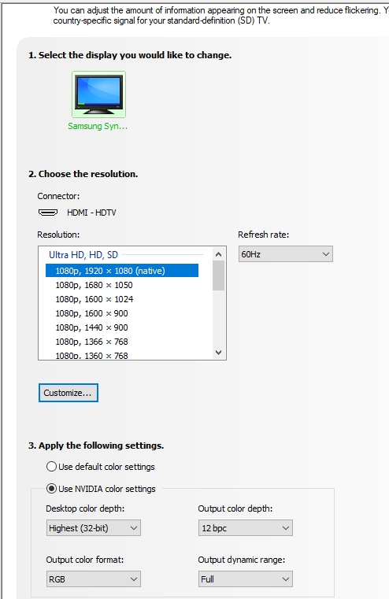
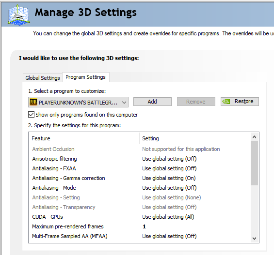
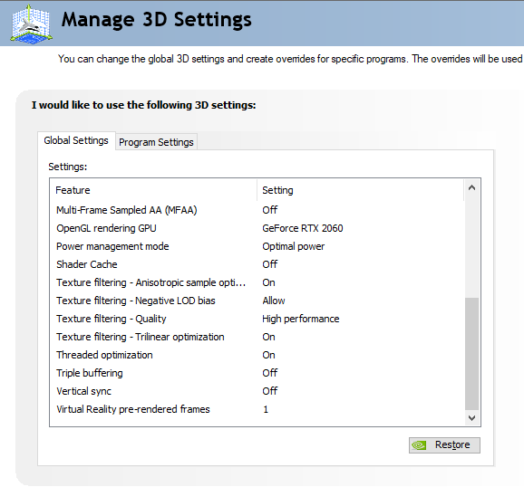
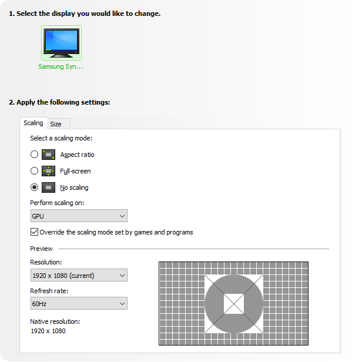

What I also found?
Sometimes it's worth trying 'Fast Sync' instead 'Vsync: OFF'
It can also help.

You can also try second preset that my friend has tested and also confirmed to work.
It's slightly different and I will still recommend upper ones, but If those won't help, give a try to my friend's preset:

FRIEND’S SETTINGS

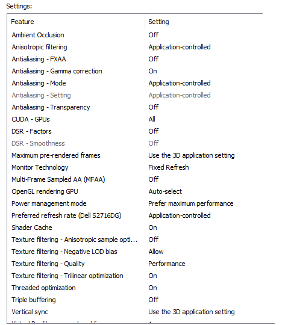
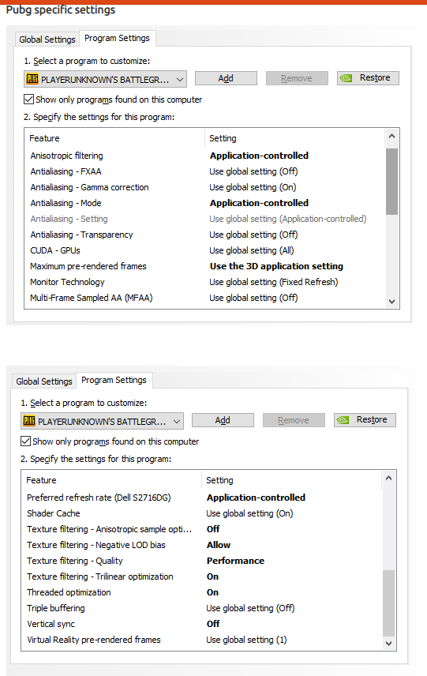
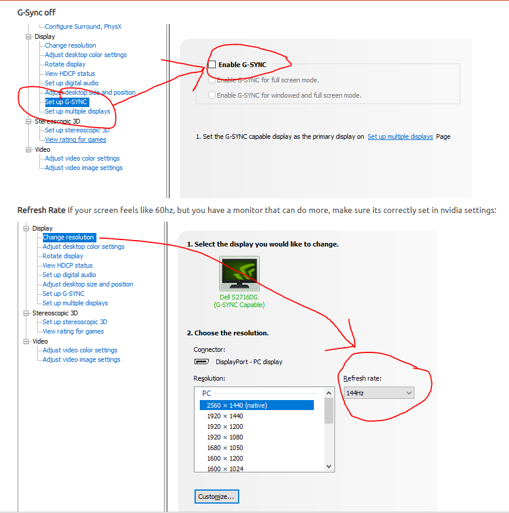

IMPORTANT THING: Maximum Pre-Rendered frame option.

If you're low end PC owner (max 60fps) - Set Max Pre rendered frame to 1
If you have more than 80-100 fps - Set Max Pre Rendered Frame to X > 1
I suggest trying 3

You can also try App Controlled option.

Big reddit post about it - https://www.reddit.com/comments/9vte98

### 3. Nvidia Inspector
Third party software that you MUST download
Settings

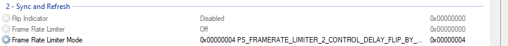

### 4. Nvidia Overlays
Disable NVidia overlays in GeForce Experience

### 5. Disable Nvidia telemetry
Just download the software and disable everything.
You can do it other ways, but this one is the simplest and 'newbie friendly'
https://www.majorgeeks.com/mg/getmirror/disable_nvidia_telemetry,1.html

## Win10 settings and fixes
### 1. Windows Updates
Before Installing new Windows update, make sure It will not affect your gaming performance!
If you install every single Windows update, I highly recommend you checking in google which one was decreasing performance.
How can you check your windows updates?

Control Panel -> Uninstall a program -> View Installed Updates

There you go :)
Check every 'KBxxxxxx' number in google to see what every update contains and about which one people were complaining about.

### 2. 'Ultimate Performance' power mode for W10
Enable 'Ultimate Performance' power mode for W10, versions 1803+. You can easily google it.
You can also try 'High performance mode'
Some people did claim to have their stutter reduced few updates ago.
It's still worth giving it a try, even If it might be considered as placebo in current W10.
As I said in the beginning - Everything depends of your setup and even the most stupid placebo changes can help.

### 3. SSD
If you're SSD user, make sure your PUBG is installed on the SSD.

### 4. Defrag your HDD
Do not know how? Google it.
To lazy? Download third party software called 'SmartDefrag' and It's gonna do everything for ya.

### 5. Search -> MSConfig -> Startup (disable everything that you do not need)

### 6. Disable Antiviruses
You do not want to? Give it a try and check your ingame performance.
You can also turn it ON again :)

### 7. Windows Defender
There are two files:
1. TslGame.exe
2. TslGame_BE.exe

You gotta add them as an exception to your FireWall and Antivirus.

### 8. Windows Virtual Memory settings
There are actually few things you can do, BUT the most important:

* Make sure Automatically manage paging file size for all drives is unticked
* If you have an ssd drive, make sure to use that one for the paging file

_1gb = 1024mb_

Option number 1:
- 'System Managed Size' and this is really safe option. System will do everything for you.

Option number 2:
If you have 8gb physical ram, follow the way down:
- Initial size: 8x1024(1024 =1gb) x 1.5
- Maximum size: 36864

Option number 3:
If you have 8gb ram:
- Initial 8.000
- Maximum: 8.000

If 16:
- Initial 16.000
- Maximum 16.00

Option number 4:
- Use recommended option for initial and maximum.
Recommended option is placed on the bottom side of the whole window.

Option number 5:
- If you're 8gb user:
Initial: 1028x32
Maximum size: 1028x64

### 9. Audio Format
Realtek Audio Manager -> Default Format -> 16 bit 44100Hz CD Quality.
Or
Right-click the speaker icon in your system tray and click Sounds
Select Playback Devices Tab.
Select your speaker, then click Properties.
Click the Advanced tab.
Click the drop-down and it will show you the sample rate and bit depths options
Choose 16Bit 44100Hz (CD Quality)

### 10. Mouse polling rate
If possible, decrease the polling rate from 1.000mhz to 500mhz.

### 11. Hidden process - “Game Bar Presence Writer”
There's something called by players 'Hidden process' that appears only when you play games.
You gotta disable it.
The process is called: "Game Bar Presence Writer'
Youtuber 'Gaming & Performance' made a YouTube guide about it called: "Tutorial to Fix Stuttering In Almost All PC Games' and 'Tutorial to Fix Stuttering In Almost All PC Games Part II'. Give it a try :)

Really simple to do and he explained it much better than I could.
Give him a like and sub!

### 12. Windows10 XBox features
Disable Overlay, gamebar, EVERYTHING.
You can also uninstall this thing using Command Prompt.
Google it!

### 13. Important step - 'EmptyStandByList Cleaner'
YouTube guide: '2018- 100% FIX PUBG AND OTHER GAME STUTTERS AND FRAME DROPS!! FINALLY!' by LooneyGoonX.

BEGINNER FRIENDLY V2 - You can also download and configure software called 'ISLC'
Simple to use and it does exactly the same as the task that you create by following LooneyGoonX's guide.

### 14. Uninstall everything that you do not need!!!
I know people that had few browsers, tons of crap and startup things.
Disabling and uninstalling this shit did provide a HUGE improvement for the whole system.

## Third party software fixes and settings
### 1. Unpark your CPU
Download third party software called 'Unpark your CPU'. Set everything to 100% and apply settings.

### 2. Set Timer Resolution
Download software called 'Set Timer Resolution'. ALWAYS open it as an admin before playing games, set 'MAXIMUM' and minimize the software.
There we go :) Simple, right?

### 3. Google Chrome
Open Google Chrome, go to settings -> advanced -> system -> disable both.

###4. UnrealEngine
Download 'EpicGameLauncher' and download 'UnrealEngine'. Why? It's really, really weird, but a few months ago people claimed It was improving their game smoothest, weird, right?
I told a group of 10 people to download it, without answering their questions, and they also noticed that their PUBG works much smoother.
If you are desperate and you really have a free space, give it a try :)
If It doesn't help, you can uninstall it everytime.

### 5. Discord
Open Discord. Settings -> Overlay -> Disable ingame Overlay Settings -> Appearance -> DISABLE 'Hardware Acceleration'

### 6. Use ADW Cleaner

### 7. MSI Afterburner and RivaTuner
Make sure you can check out your FPS, Frametimes Graph, CPU all cores/GPU % usage.

If you can't get stable 80 fps - Lock it to 70 and 60.
Check frametimes and fps drops.

IF everything works smoother, leave it.
You do not want fucked up frame times that increase and decrease every second.
You want as stable FPS and frametimes as possible.

If you can't hold 110, try 80 and 90.
If it works, leave it this way.

Can't hold 150? Try 120 and 130 etc etc

## FOR ADVANCED USERS ONLY!!!!
### 1. Win10 services
Win10 itself has many services that you do not need and that consumes your resources.
Get rid of:
- Windows update(Set to manual or disable it If you do not want to get windows updates)
- Windows Search(disable)
- Windows Cortana(disable)
- Nvidia Telemetry(disable this shit)
- Connected User Experiences and Telemetry(disable)
- DIAGNOSTIC POLICY SERVICE AUTOMATIC(disable)
- Distributed Link Tracking Client(disable)
- dmwappushsvc(disable)
- Superfetch(disable)

If you see more services that you do not need, make sure you disabled them.

### 2. Other Windows 10 optimizations
There are a few YouTube guides about Windows10 optimization for gaming.
Newbie friendly and that will not cause any problems.
Most changes that you're gonna see there are placebo, but as I said @up - Sometimes even 0.01% benefit placebo change can help in PUBG so... give it a try.

Youtube author - Panjno made a huge guide about it.
Feel free to follow his guide and you can give him a like to support his useful video :)

GUIDE FOR ADVANCED PEOPLE ONLY: YouTuber called FR33THY made very useful guide(Remove Windows 10 Bloatware 1809 Boost Performance And FPS)

IF YOU ARE NOT AN ADVANCED USER, DO NOT FOLLOW THIS GUIDE! IT'S ONLY FOR PEOPLE THAT REALLY KNOW WHAT THEY DO!!!!!!!

### 3. The best possible option
Reinstall your system and after that make all of the optimization changes from this guide.

### 4. Take care of malware, viruses and everything!
Good, long scan.
Give it time, be patient.

### 5. OC your CPU If it’s possible
Just make sure to watch out for CPU temperatures.

### 6. AHCI Link Power Management
I have nothing more to say, just follow the guide - https://www.tenforums.com/tutorials/72971-add-ahci-link-power-management-power-options-windows.html

### 7. Install Intel Rapid Storage Technology
Google it.
MAKE SURE YOU DO EVERYTHING CORRECT!
ADVANCED USERS ONLY!!!
YOU MUST KNOW WHAT YOU DO!!!

### 8. Debloat Windows10
I have nothing more to say.
If you’re an advanced user, you’re gonna know how to use.
There’s one very amazing guide on GitHub about it.
I won’t give the link, because If somebody really knows what to do, will be able to find it.
It’s high risk/high reward thing and you do everything on your own risk.

## PUBG Fixes
### 1. Fullscreen optimizations
Go to your PUBG folder and disable 'fullscreen optimization' of ExecPUBG.exe; TSLGame.exe; TSLGame_BE.exe and 'Change high DPI Settings' to application controlled.

### 2. SteamVR and Input Per-Game
RMB PUBG - "Use Desktop Game Theatre while SteamVR is active" and set the "Steam Input Per-Game Setting" to "Forced Off".

### 3. NEVER EVER use 'Launch Option'
If you read other guides and their authors claim it's gonna help - NO, IT WILL NOT!
People had been using launch options during Alpha and Beta to get the best possible results, because the game was performing like a total crap. In the current state of the game, it's HIGHLY RECOMMENDED to not use any launch options, because it might have a negative impact on your performance, so make sure you do not use launch options anymore.

### 4. Remove your PUBG
1. %localappdata%
2. Delete TslGame
3. Program Files (x86)\Common Files\BattlEye4
    - delete BEService_pubg.exe
4. Program Files (x86)\Steam\steamapps\common and delete PUBG folder
5. In Steam go to Settings>Downloads and click on CLEAR DOWNLOAD CACHE
6. Restart Steam

### 5. Verify the integrity of ingame files

### 6. ALWAYS run steam as admin

### 7. High priority to all of the PUBG processes (there are 3) when the game is opened.

### 8. Ingame settings
!Disable 3d character render when checking inventory.
!Disable ingame tips.
!Make sure you run the game in FULLSCREEN mode!

Website to check the difference between ‘Very Low’ and ‘Ultra’.
https://imgsli.com/MTk0Mg/24/0

Resolution: It’s always the best idea to use your screen resolution.
If your PC really sucks, you can try to lower it.
Lobby FPS Limit: 30-60
Ingame FPS Limit: Disabled
FPP FoV: 80-103
ScreenScale: 95-120
AA: Very Low - Ultra
PP: Very Low
Shadows: Very Low
Textures: Very Low - Ultra
Effects: Very Low
Folliage: Very Low - Low ; Ultra
ViewDistance: Very Low - Ultra
V-Sync: OFF
MotionBlur: OFF
Sharpen: ON

NOTE:
1. Some settings are useless and consume your resources.(PP ; shadows ; effects ; motion blur) and you always want to disable them or keep them on as low level as possible.
2. If you can’t stand very low details, AA and Textures are the only one options that you wanna increase.
    ‘Medium’ is the best possible option to get decent performance and ingame visibility.
3. Sharpen is the best optimized option. You should always enable it!
4. It’s weird, but ‘having fun’ with settings like ViewDistance and Folliage might sometimes help, in terms of increasing performance and getting rid of ‘render freezes’ when driving vehicles etc.
    I use both settings on medium.
    Most of streamers and pro players keep both options on very low, or only view distance on medium-ultra.
5. If you use AA higher than ‘Very low/low’, think about using higher Screen Scale. Of course If your PC allows you to.
    It will increase your visibility, but it’s gonna cost you some FPS.
6. If you know that you’ve been dealing with bottlnecking, using higher settings might make your game run better.
    As an example, I’m gonna highly recommend using screen scale 120, textures ultra, AA Very Low - Ultra ; View Distance/Folliage Ultra.
7. If your PC really sucks, you can try lowering your Screen Scale.
    I do not recommend going below 95-100.
8. FPP FoV is mostly a preference, BUT higher FoV = lower FPS.
    Lower FoV = lower vision

I find 85-95 as the best balance between visibility and performance.

### 9. Remove your config
!!!! IT’S GONNA REMOVE ALL OF YOUR INGAME SETTINGS !!!!

%localappdata%
TslGame\Saved\Config\
Delete the folder WindowsNoEditor

## BIOS
### 1. HPET in Bios and Windows10
Disabling HPET is top1 FPS fix in the game called 'OverWatch'.
I also noticed improvement in PUBG.
You MUST give it a try!

Do not forget to disable it in BIOS and after doing it, make sure to use proper command in Win10 to also disable it.

### 2. OC your RAM
This thing is gonna massively improve your performance!
How can you do it? Through BIOS.
Just enable XMP, if your motherboard and RAM supports it.

## Connection improvement
### 1. Enable port forwarding for PUBG
All of the used ports are here:
https://portforward.com/playerunknowns-battlegrounds/

### 2. Run http://www.dslreports.com/speedtest test
If your BufferBloat is lower than 'Rank A".

Google: 'Router QoS - Improve bufferbloat'.

If your router do not support QoS function:
- Download third party software called 'Tmeter'.
- Follow this guide: https://www.howtogeek.com/347711/how-to-limit-any-applications-bandwidth-on-windows/

Remember one thing - 'google chrome exe' is an application that you use to check the best possible result of bufferbloat.
If you manage it to get rank A or A+ on google chrome, you are gonna do exactly the same to a file 'TSLGame.exe'. Settings that gave you A or A+ on ‘google chrome app’, you also use for TSLGame.exe file.

If you had bufferbloat below rank A, and now you have done everything correctly - Your hit registration should improve and your ping raises should be lower.

### 3. Download TCP Optimizer
Use my settings:

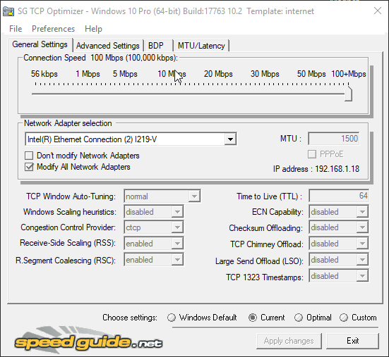
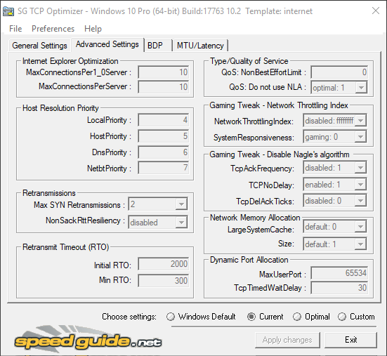

IMPORTANT: 'General Settings' --> Connection Speed --> Set your connection speed.
My download speed is higher than 100mb so I set it to higher than 100mb.
If you have 50mb, set it to 50mb.

### 4. Think about using a VPN
I can recommend two VPNs for PUBG: Outfox and CyberGhost.

### 5. Network Adapter Reset
- Run cmd.exe as Admin
- Use commands:

    ipconfig /release
    ipconfig /flushdns
    ipconfig /renew|
    netsh winsock reset catalog
    netsh int ip reset reset.log

- Restart Computer

## Testers's components and results
The guide has been tested with a group of 20+ people with totally different PC setups.
I can say almost everybody noticed improvement. Results depend of PC setups.

Hope you’re gonna appreciate few weeks of testing those things and spending a lot of hours talking and sharing results to each other.

Results:
**Low-end PC Setups:**
- FPS Freezes and Stuttering reduced.
- Game is more playable and enjoyable.
- Games seems to no longer freeze and stutter during fights.
- Stuttering reduced from 70 to 90% !!!
- More stable FPS.

Note: As I said - It’s setup depended, but some low-end users claim to longer deal with FPS stuttering and their huge freezes seems to be reduced by a lot.

**Low Medium/Medium/Medium end PC setups:**
- FPS Freezes and Stuttering highly reduced or completely deleted.
- People claim to no longer have problems with freezes and FPS stuttering.
- More stable FPS.

**High end and NASA setups:**
- More stable FPS
- If somebody suffered stutters, no longer deals with this problem.

THE MOST IMPORTANT:
- Low End and Medium class PC users claim to have from 5 to 20 fps MORE.
- The most popular problems like FPS Stuttering ; FPS/Lag ; Freezes seems to be completely removed or highly reduced for most of users.

**PC components** (Some people had exactly the same GPU and CPU so I do not count it)

1. GPU

    GTX 760; GTX770; GTX970; GTX 1060; GTX1070; GTX1070TI; GTX1080; GTX1080TI; RTX 2060; RTX2070; RTX 2080TI; RX590 Nitro; RX Vega 56; RX Vega64; RX 480; RX 580; GTX1660.

2. CPU

    i5 6600k; i5 7400; FX 8350; i9 9900K; i3 8100; i7 8700; i5 6400; Ryzen 5 2600; i7 8700k; FX 4100; i5 8500; i5 7500; i5 8400; i9 9820X; i7 7700; i5 9600k; Ryzen 5 2600k; Ryzen 7 2700x; Ryzen 5 1600X; i5 6500; i5 7600k.

3. Ram

    Amount of ram seems to not make a big difference.
    The difference between 8 and 16 is not that big, really.
    The most important aspect - SPEED OF RAM!!!
    Faster ram -> Better gains.
    8gb faster ram a lot better than 16gb slower ram.

    Most players: 8 - 16gb.
    Only one: 32gb.
    Dual channeled.
    From 2133mhz to 4000mhz.

    Mainly Corsair, Kingston, Patriotic, HyperX.

4. Discs

    HDD; SSD; M2.

    Only 7 people did not have SSD.

## Last words

Well…
That’s it.

If you read the guide - High five!
Thank you for reading the biggest guide I’ve ever written.
It took me some time to test everything, gain data, get a group of people that would like to test everything with me, a group of people that helped me with editing everything to make it look as clear as possible…

It was not easy, but 100% worth!
No doubt, you’ve just read the best PUBG Performance guide ever made.

Hope you appreciate it and most of your problems are gone!

If you wanna show me your appreciation - Please, like my guide, show it to your friends, or maybe you wanna sent me something.
Every kind of appreciation will be appreciated :D
- https://www.buymeacoffee.com/Stream
- https://steamcommunity.com/tradeoffer/new/?partner=177717593&token=NO-4pP9D

You can also add me on steam to get some additional info If any of your problems was not fixed.
But before adding me, please leave a comment. I have hundreds of unaccepted invitations.
Some problems are update or server related and can not be fixed, sadly :/

## CREDITS
Project creator:
- Stream AKA ‘In It to Win it’

Idea:
- Stream AKA ‘In It to Win it’

Realisation:
- Stream AKA ‘In It to Win it’
- id_R00t

Testers/Data providers:
- Stream AKA ‘In It to Win It’
- id_R00t
- Team Pentagram
- Team Milos
- Team OverWatchFraggers
- Team GachiFaggs
- Natural Born Killers
- Glory
- Papysh
- TopKek
- Blitzi AKA Blitz
And other team’s friends

Text:
- Stream AKA ‘In It to Win It’

Text editors:
- Stream AKA “In It to Win It’
- id_R00t

Graphic editors:
- id_R00t

Corrector:
- Blitzi AKA Blitz

## SUPPORTERS
### PRO Players
#### PUBG PRO PLAYERS
1. Team Vitality
‘mOnKeY_LeSinge
Stream - https://www.twitch.tv/monkey_lesinge

2. G2 Team
Old member ‘Wacko’
Stream: https://www.twitch.tv/wacko

#### APEX LEGENDS PRO PLAYER
1. Team Penta Apex
Wacko
Stream: https://www.twitch.tv/wacko

#### Osu! PRO PLAYER
1. Kynan: https://www.twitch.tv/kynan383

### Youtube content creators
1. Player IGN

## Communities
1. PlayerIGN’s discord server!

    Owner - PlayerIGN.
    Thank You for appreciation and sharing my guide with your community!
    Also, HUGE THANK YOU to your Discord community that really appreciated my work, gave me an amazing feedback and motivation!

2. EU TALENT PUBG Discord server

    Owner of the server - xtrasterkgrimm
    Thank You so much for supporting my guide and sharing it with your huge discord community!

    Server Admin - Jinxue
    Thank You so much for being so kind and amazing feedback!

3. Team Vitality mOnKeY_LeSinge Discord Server

    Owner - mOnKeY_LeSinge
    Thank You so much for showing my guide on your stream and sharing it to people from your Discord server!

4. Osu! Kynan’s Discord Community

    Owner - Kynan
    Thank You for sharing my guide with your Osu! Community and appreciating my work!

5. Wacko’s place Community/Apex Team Penta Discord server

    Owner - Waco
    Thank You for a motivation and huge appreciation to the work I’ve done!

6. Kaymind’s Nest Discord Community

    Server admin - Sethlas
    Thank You so much for great feedback!

7. mikesunboxinga&a Discord

    Owner - mikeunboxing
    Server admins:
    - CHARLES
    - CmcKnight1971
    Thank You guys for good words and appreciating my work!

___

**Thank You so much guys for few weeks of great cooperation!
This guide would not be made without the support, motivation and dedication you provided to me!
I had a really amazing group of people to test everything and give me proper feedback!
We can do everything!**

© Copyright: I do not allow to copy/paste the guide without asking me. Before sharing it, ask me for permission.
